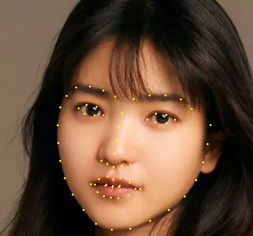
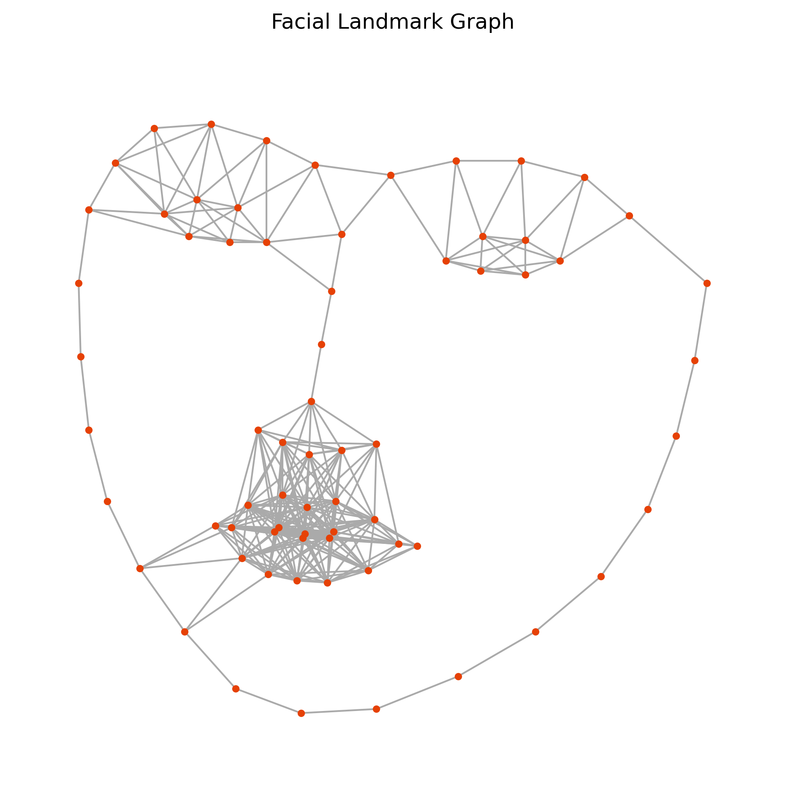

# Face Key Points Detector

This project detects **68 facial landmarks** using `dlib` and visualizes them with **OpenCV** and **NetworkX**.  
It builds a **graph** where each node is a facial keypoint and edges represent spatial connections based on distance.

---

## Features

- Detects 68 facial landmarks using the pretrained dlib model  
- Visualizes landmarks directly on the image using OpenCV  
- Builds a NetworkX graph of landmarks and their spatial relations  
- Automatically saves both visualizations in the `results/` folder  
- Includes clear error messages and modular structure (`main()`)

---

## 📂 Project Structure

```text
Face-Key-Points-Detector/
│
├─ src/
│   └─ detect_keypoints.py        # main script
│
├─ models/
│   ├─ haarcascade_frontalface_alt2.xml
│   └─ shape_predictor_68_face_landmarks.dat
│
├─ images/
│   └─ sample_face.png            # example input
│
├─ results/                       # automatically created on run
│   ├─ landmarks_YYYYMMDD_HHMMSS.png
│   └─ graph_YYYYMMDD_HHMMSS.png
│
├─ requirements.txt
└─ .gitignore
````

---

## Setup (Windows Example)

### Create and activate a virtual environment

```bash
cd "C:\Users\asus\Face-Key-Points-Detector"
python -m venv venv
venv\Scripts\Activate
```

If PowerShell blocks activation:

```bash
Set-ExecutionPolicy -Scope Process -ExecutionPolicy Bypass
venv\Scripts\Activate
```

### Install dependencies

```bash
python -m pip install --upgrade pip
pip install -r requirements.txt
```

### Download the pretrained model

Download this file:
👉 [shape_predictor_68_face_landmarks.dat.bz2](https://dlib.net/files/shape_predictor_68_face_landmarks.dat.bz2)

Extract it, and place `shape_predictor_68_face_landmarks.dat` inside the **models/** folder.

---

## Run the Project

```bash
python -m src.detect_keypoints
```

You’ll see:

1. An OpenCV window showing detected facial landmarks.
2. A Matplotlib window with the landmark graph.
3. Both saved automatically in the `results/` folder.

---

## Example Results

### 🎯 Landmark Detection



### 🌐 Graph Representation



*(Tip: you can rename one pair of output images to `landmarks_example.png` and `graph_example.png` to keep them as fixed samples in your repo.)*

---

## Requirements

* Python ≥ 3.9
* dlib
* opencv-python
* numpy
* networkx
* matplotlib

Install all automatically with:

```bash
pip install -r requirements.txt
```


